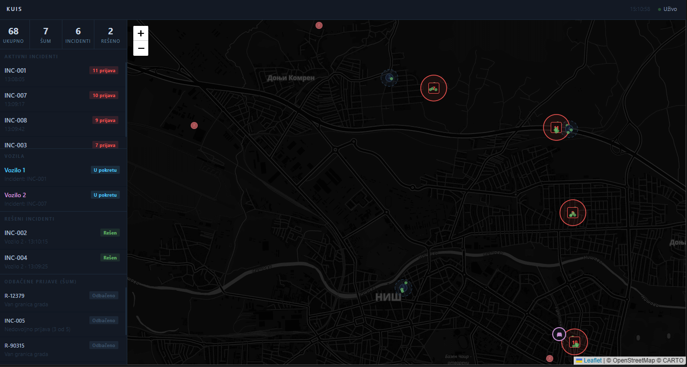

# UPUTSTVO

## Kratak opis projekta
Ovo je prototip komandno‑upravljackog informacionog sistema (KUIS) za detekciju i praćenje incidenata zasnovan na prijavama sa terena. Komponente:
- Producers: simuliraju prijave (Kafka producer).
- Consumer/Processor: konzumira prijave, grupiše u klastere, verifikuje incidente i emituje verifikovane incidente.
- Backend (FastAPI): upravlja vozilima, rutiranjem (OSRM), i šalje snapshot frontend‑u preko WebSocket‑a.
- Frontend: statična SPA (Leaflet) koja prikazuje mape, klastere, incidente, vozila.
- Kafka stack (Zookeeper + Kafka + Kafka UI) u docker‑compose.yml.



## Tehnologije
- Python (FastAPI, uvicorn)
- kafka-python
- Kafka (Confluent image) + Zookeeper
- Kafka UI (provectuslabs/kafka-ui)
- Leaflet (frontend)
- OSRM javni routni servis (backend koristi za rute)

## Kako pokrenuti (lokalno)
1. Pokrenuti Kafka stack:
   - `docker-compose up -d`
   - Provera: Kafka UI na `http://localhost:8080` (konfig iz docker‑compose.yml)

2. Instalirati zavisnosti:
   - `pip install -r requirements.txt`

3. Pokrenuti backend (FastAPI + processor):
   - `python -m uvicorn backend.main:app --reload --port 8000`
   - Napomena: backend na importu startuje i `consumer.processor` (processor) kao thread, pa nije neophodno startovati consumer posebno.

4. Pokrenuti proizvođača (simulator prijava):
   - `python producers\crowd_producer.py`

5. Otvoriti UI:
   - `http://localhost:8000` — prikaz mape i real‑time podataka preko WebSocket `/ws`.

## Bitni fajlovi, parametri i gde se nalaze

1) - producers/crowd_producer.py
   - Opis: generator simuliranih prijava. Pokreće KafkaProducer i šalje poruke na topic `crowd-reports`.
   - Glavne promenljive: KAFKA_BROKER, TOPIC, NS_LAT, NS_LON, NOISE_LAT, NOISE_LON, sleep interval.
   - Funkcije:
    - in_city(lat, lon): vraća True ako je tačka unutar NS_LAT/NS_LON bounding box-a.
    - make_report(lat, lon): pravi JSON objekt prijave sa report_id, lat, lon, timestamp.
    - main(): postavlja KafkaProducer, pravi skup 'hotspot' tačaka i u petlji šalje 1-2 prijave po aktivnom hotspotu, povremeno generiše 'noise' izvan opsega grada. `time.sleep(12)` kontroliše tempo. Promena 'hotspot' logike ili intervala menja stopu i raspodelu prijava.

2) - consumer/processor.py
   - Opis: srce logike za klasterizaciju i verifikaciju. Konzumira poruke sa `crowd-reports`, održava in-memory state `situation`, i  kad klaster postane incident emituje događaj na `verified-incidents`.
   - Ključne globalne strukture:
    - _clusters: mapiranje id->klaster objekat (s listom prijava, centroidom, timestampima)
    - _incidents: verifikovani incidenti
    - situation: snapshot koji backend koristi za broadcast frontend-u
    - lock: threading.Lock() za sinhronizaciju izmena
   - Važne funkcije:
    - haversine(lat1, lon1, lat2, lon2): metrička udaljenost — koristi se pri pronalaženju najbližeg klastera i dodeljivanju vozila.
    - centroid(reports): računa centar klastera posle dodavanja prijava.
    - in_city(lat, lon): brzo filtriranje prijava van opsega.
    - find_cluster(lat, lon): traži najbliži klaster unutar CLUSTER_RADIUS_M; vraća cid ili None.
    - add_to_cluster(cid, report): dodaje prijavu u postojeći klaster, ažurira centroid i last_update.
    - new_cluster(report): kreira novi klaster (ID format INC-XXX), povećava statistiku klastera.
    - try_verify(cid, producer): proverava da li broj prijava >= INCIDENT_THRESHOLD; ako jeste, obeležava klaster kao verifikovan i šalje Kafka poruku na INCIDENT_TOPIC. Ako je klaster već verifikovan, samo ažurira brojač.
    - resolve_incident(incident_id, vehicle_name): koristi se kada vozilo stigne i reši incident; menja status incidenta u RESOLVED, uklanja povezane prijave iz `situation["all_reports"]` i briše klaster/incident iz aktivnog set-a.
    - cleanup_loop(): periodična nit koja uklanja stare (stagnirane) klastere čiji last_update prelazi CLUSTER_TTL_SEC; takvi klasteri se klasifikuju kao šum (ako manji od threshold).
    - consume_reports(): glavna petlja KafkaConsumer-a. Za svaku poruku radi validaciju, filtriranje, pronalaženje ili kreiranje klastera, ažuriranje snapshot-a i poziv try_verify.
    - start(): pokreće cleanup_thread kao daemon i startuje consume_reports().

Uticaj promena:
- Povećanje CLUSTER_RADIUS_M spaja udaljenije prijave -> manje klastera, veći klasteri.
- Smanjenje INCIDENT_THRESHOLD dovodi do ranije verifikacije (više incidenata).
- Smanjenje CLUSTER_TTL_SEC briše klaster brže -> više prijava klasifikovanih kao šum.

3) - backend/main.py
   - Opis: FastAPI servis koji služi frontend i upravlja simulacijom vozila. Importovanjem pokreće consumer.processor.start() u zasebnoj niti.
   - Glavne strukture:
    - vehicles dict: stanje vozila (id, ime, pozicija, status, mission, route, step)
    - SCENE_WAIT_SEC: koliko dugo vozilo provede na mestu incidenta
    - connected_clients: lista aktivnih WebSocket konekcija
   - Važne funkcije:
    - get_route(slat, slon, elat, elon): poziva javni OSRM endpoint i vraća niz [lat, lon] koordinata rute. Ako OSRM ne odgovori, vraća prazan niz.
    - assign(): bira prioritetne ACTIVE incidente i dodeljuje najbliže slobodno vozilo (status STANDBY); koristi haversine za udaljenost i get_route za putanju.
    - async move_vehicles(): pomera vozila duž rute simulirano; pri dolasku postavlja status ON_SCENE i nakon SCENE_WAIT_SEC poziva resolve_incident; periodično poziva assign() i ažurira situation["vehicles"].
    - HTTP/WS rute:
      - GET / : vraća frontend/index.html (statika).
      - websocket /ws : prima i čuva konekcije, ne očekuje korisničke poruke osim ping-a.
    - async broadcast(): svake ~1.2s pravi JSON snapshot `type:'update'` i šalje svim connected_clients.

4) - frontend/index.html
   - Opis: single-file SPA sa Leaflet mapom i UI panelima. Spaja se na `ws://<host>/ws` i dobija periodične snapshotove.
   - Ključne komponente:
    - Map setup: base layer, start view, četiri LayerGroup-a (klasteri, incidenti, šum, vozila).
    - Marker management pattern: `clMk`, `incMk`, `reportMk`, `vehMk`. Marker objekti se ne kreiraju/brisu često — umesto toga se ažuriraju da bi animacije bile glatkije i da se izbegne flicker.
    - Važne JS funkcije:
      - syncClusters(clusters): ažurira/kreira krugove i marker-e za ne‑verifikovane klastere; uklanja verifikovane.
      - syncAllReports(reports): sinhronizuje pojedinačne prijave (male zelene tačkice); uklanja prijave koje su rešene ili istekle.
      - syncIncidents(incidents): crta incidente kao velike crvene krugove i markere sa popup-om.
      - syncVehicles(vehicles): prikazuje vozila, animira status i pozicije; popup prikazuje ime, status i misiju.
      - syncNoise/noise render funkcije i sidebar render funkcije.
      - connect(): otvara WebSocket, drži konekciju živom slanjem ping-a i obradom poruka tipa `update`.

## Formati poruka (primeri)
- Producer -> crowd-reports (JSON):
```
{
  "report_id": "R-12345",
  "lat": 43.333456,
  "lon": 21.905678,
  "timestamp": "2026-05-22T14:00:00.000000"
}
```

- Processor -> verified-incidents (JSON):
```
{
  "id": "INC-003",
  "lat": 43.333456,
  "lon": 21.905678,
  "report_count": 6,
  "status": "ACTIVE",
  "verified_at": "2026-05-22T14:03:00.000000",
  "resolved_at": null,
  "resolved_by": null
}
```

- Backend -> Frontend (WS payload `type: 'update'`):
```
{
  "type":"update",
  "clusters": [...],
  "incidents": [...],
  "vehicles": [...],
  "all_reports": [...],
  "resolved": [...],
  "noise": [...],
  "stats": {...}
}
```

## Dataflow
1. Producer (producers/crowd_producer.py) šalje JSON poruke na topic `crowd-reports`.
2. Consumer/Processor (consumer/processor.py) konzumira `crowd-reports`, radi geo‑klasterizaciju, održava stanje `situation` i, po dostizanju `INCIDENT_THRESHOLD`, šalje poruku na `verified-incidents`.
3. Backend (backend/main.py) u real‑time čita stanje iz `consumer.processor.situation`, dispatchuje vozila (funkcija `assign()`), koristi OSRM za rute i emituje snapshot preko WebSocket `/ws`.
4. Frontend (frontend/index.html) prima `update` payload i renderuje mapu, liste incidenata, vozila i šum.
5. Kada vozilo stigne, backend poziva `resolve_incident(...)` koji briše prijave i označava incident kao RESOLVED.

## Korisnički interfejs i interakcija
Kada se aplikacija otvori u browseru, korisnik ima kompletan pregled situacije u realnom vremenu:

### Vizuelni identifikatori na mapi:
- Male zelene tačke: Pojedinačne, sirove prijave koje pristižu sa terena.
- Sivi krugovi sa brojem: Privremeni klasteri koji se dinamički formiraju. Broj u centru označava koliko je prijava unutar tog radijusa.
- Veliki crveni krugovi: Verifikovani incidenti na koje sistem automatski šalje najbliže slobodno vozilo.
- Crvene ikone sa oznakom "✗": Odbačene prijave (šumovi). Klikom na marker otvara se prozor sa tačnim razlogom odbacivanja (npr. "Van granica grada" ili "Nije pređen minimalni prag").
- Ikone vozila: Prikazuju interventne jedinice u realnom vremenu. Vozilo pulsira kada je u pokretu ka lokaciji.

### Interakcija sa sistemom:
- Automatsko ažuriranje: Korisnik nema potrebe da osvežava stranicu, jer WebSocket klijent konstantno osluškuje promene stanja i ažurira Leaflet slojeve bez treperenja ekrana.

## Ključne promenljive i šta znače
- cluster vs incident: klaster = privremena grupa prijava; incident = verifikovan klaster (dostigao threshold).
- all_reports: list svih aktivnih prijava prikazanih na mapi
- noise_reports: prijave/klasteri koji su označeni kao šum
- resolved: poslednjih 20 rešenih incidenata
- status vozila: STANDBY, ON_ROUTE, ON_SCENE

## Primeri promena i efekata
- Smanjiti INCIDENT_THRESHOLD sa 5 na 3 → više incidenata, brže dispatchovanje.
- Povećati CLUSTER_RADIUS_M sa 120 na 300 → više prijava će pripadati istom klasteru.
- Smanjiti CLUSTER_TTL_SEC sa 90 na 30 → klasteri brže ističu i više prijava ide u `noise_reports`.
- Povećati `time.sleep` u produceru → manja brzina generisanja prijava.
- Dodavanje vozila: izmeniti `vehicles` dict u backend/main.py i restartovati backend.

---

## Zašto Kafka i WebSocket?
- Kafka
  - Implementacija arhitekture vođene događajima (Event-Driven Architecture), visoka durabilnost, labavo spregnute komponente (proizvođači i konzumenti su potpuno nezavisni)...

- WebSocket
  - Full‑duplex, niske latencije za push notifikacije, pogodna za real‑time UI (mapa, vozila). Manje HTTP overhead-a u odnosu na polling.

- Kombinacija
  - Kafka obezbeđuje pouzdan i asinhron put podataka kroz backend pipeline, dok WebSocket obezbeđuje nisko‑latentno prikazivanje tih podataka korisnicima u browseru.